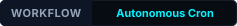
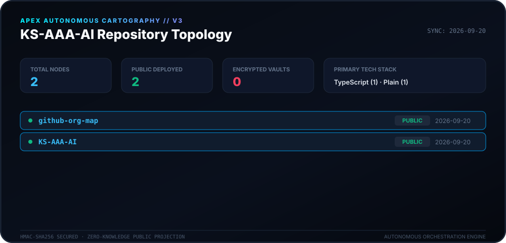
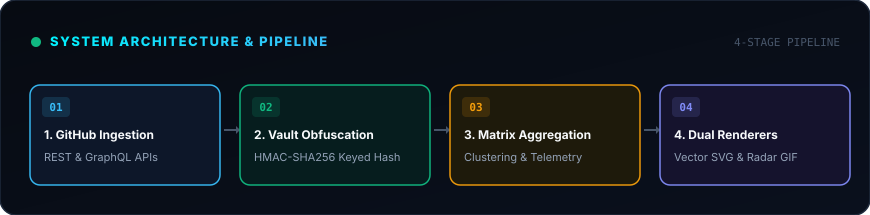
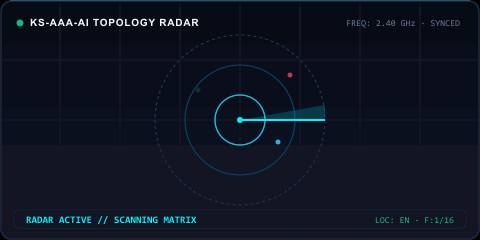

<div align="center">

# 🛰️ Apex Cartography Engine (v3.0)

<p>
  <strong>Autonomous daily cartography and topology mapping for the KS-AAA-AI ecosystem.</strong>
</p>

<p align="center">
  <strong>🇺🇸 English</strong> · 
  <a href="locales/ko.md">🇰🇷 한국어</a> · 
  <a href="locales/zh-CN.md">🇨🇳 中文</a> · 
  <a href="locales/es.md">🇪🇸 Español</a> · 
  <a href="locales/hi.md">🇮🇳 हिन्दी</a> · 
  <a href="locales/ar.md">🇸🇦 العربية</a> · 
  <a href="locales/pt-BR.md">🇧🇷 Português</a> · 
  <a href="locales/ru.md">🇷🇺 Русский</a> · 
  <a href="locales/fr.md">🇫🇷 Français</a> · 
  <a href="locales/id.md">🇮🇩 Bahasa Indonesia</a>
</p>

<p align="center">
  
  
  
  
</p>

<p align="center">
  <picture>
    <source srcset="./assets/locales/en/org-map.svg" type="image/svg+xml" />
    
  </picture>
</p>

</div>

---

<details>
<summary><h3 style="display:inline-block; margin:0; cursor:pointer;">🏛️ System Overview & Architecture</h3></summary>
<br />

**Apex Cartography Engine** is a modern, high-throughput autonomous telemetry and topology visualization system tailored for the **KS-AAA-AI** GitHub ecosystem. It transforms scattered repository states into a cybernetic matrix HUD with zero-knowledge cryptographic safeguards.

<p align="center">
  <picture>
    <source srcset="./assets/locales/en/architecture.svg" type="image/svg+xml" />
    
  </picture>
</p>

1. **Zero-Knowledge Privacy Vaulting**: Private repositories undergo salted HMAC-SHA256 transformation (`APEX-VAULT-XXXXXXXX`), ensuring internal identifiers, descriptions, and proprietary topics are never exposed to public surfaces.
2. **Deterministic Topology Mapping**: Identifiers remain stable across generations under the same cryptographic salt.
3. **Dual Render Pipelines**: High-density Vector Canvas SVG and scanning radar GIF.
4. **Self-Healing Automation**: Scheduled daily GitHub Actions workflow (`00:00 KST`) with exponential backoff against API rate-limiting triggers.

</details>

---

<details>
<summary><h3 style="display:inline-block; margin:0; cursor:pointer;">📡 Live Telemetry & Radar Scan</h3></summary>
<br />

Real-time telemetry and sweeping radar visual representation generated deterministically by the Cartography Engine.

<p align="center">
  <picture>
    <source srcset="./assets/locales/en/org-map.gif" type="image/gif" />
    
  </picture>
</p>

</details>

---

<details>
<summary><h3 style="display:inline-block; margin:0; cursor:pointer;">🛠️ Getting Started & Local Execution</h3></summary>
<br />

### Prerequisites
- Node.js >= 20
- npm / pnpm / yarn

### Quickstart
```bash
# Clone the repository
git clone https://github.com/KS-AAA-AI/github-org-map.git
cd github-org-map

# Install dependencies
npm install

# Run autonomous pipeline
export GITHUB_TOKEN="your_personal_token"
export MASK_SALT="your_cryptographic_salt"
npm run generate
```

</details>

---

<details>
<summary><h3 style="display:inline-block; margin:0; cursor:pointer;">🔒 Security Guardrails & Privacy Guarantee</h3></summary>
<br />

- **Zero Token Leakage**: Tokens are evaluated strictly in ephemeral memory and never written to disk or artifacts.
- **Fail-Closed Design**: If `MASK_SALT` is compromised or omitted in production runs, the pipeline safely terminates rather than exposing unmasked labels.
- **Local Asset Isolation**: All visual badges and graphics are served directly from the repository tree without third-party tracking CDNs.

</details>

---

<div align="center">
<sub>Released under the [MIT License](../LICENSE). Copyright © 2026 KS-AAA-AI.</sub>
</div>
