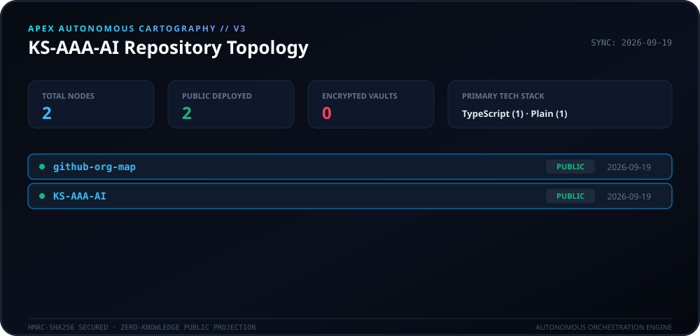

# 🛰️ Apex Cartography Engine (v3.0)

<p align="center">
  
</p>

<p align="center">
  <a href="https://github.com/KS-AAA-AI/github-org-map/actions"></a>
  <a href="LICENSE"></a>
  
  
</p>

---

## 🏛️ Overview

**Apex Cartography Engine** is a modern, high-throughput autonomous telemetry and topology visualization system tailored for the **KS-AAA-AI** GitHub ecosystem. It transforms scattered repository states into a cybernetic matrix HUD with zero-knowledge cryptographic safeguards.

- 🇺🇸 **English Documentation** · [🇰🇷 한국어 아키텍처 명세서](docs/ARCHITECTURE_KO.md)

---

## ⚡ Core Engineering Principles

```
  ┌───────────────────────┐
  │  GitHub REST/GraphQL  │  ◄── Multi-Account & Node Ingestion
  └───────────┬───────────┘
              │
              ▼
  ┌───────────────────────┐
  │  VaultObfuscator      │  ◄── HMAC-SHA256 Keyed Digests (Zero-Leakage)
  └───────────┬───────────┘
              │
              ▼
  ┌───────────────────────┐
  │  MatrixAggregator     │  ◄── Clustering & Tech Stack Telemetry
  └───────────┬───────────┘
              │
        ┌─────┴────────────────┐
        ▼                      ▼
┌──────────────┐      ┌─────────────────┐
│ VectorCanvas │      │  MotionEncoder  │
│ (HUD SVG)    │      │  (Radar GIF)    │
└──────────────┘      └─────────────────┘
```

1. **Zero-Knowledge Privacy Vaulting**: Private repositories undergo salted HMAC-SHA256 transformation (`APEX-VAULT-XXXXXXXX`), ensuring that internal identifiers, descriptions, and proprietary topics are never exposed to public surfaces.
2. **Deterministic Topology Mapping**: Identifiers remain stable across generations under the same cryptographic salt, preventing flickering or arbitrary renaming.
3. **Dual Render Pipelines**:
   - **Vector Canvas**: Precision high-density SVG dashboard styled with an Apex Cyberpunk HUD aesthetic.
   - **Motion Encoder**: Dynamic 16-frame scanning radar GIF illustrating real-time ecosystem pulsation.
4. **Self-Healing Automation**: Scheduled daily GitHub Actions workflow (`00:00 KST`) with exponential backoff against API rate-limiting triggers.

---

## 🛠️ Getting Started

### Prerequisites
- Node.js >= 20
- npm or pnpm

### Quickstart
```bash
# Clone the repository
git clone https://github.com/KS-AAA-AI/github-org-map.git
cd github-org-map

# Install dependencies
npm install

# Run the autonomous pipeline
export GITHUB_TOKEN="your_personal_token"
export MASK_SALT="your_cryptographic_salt"
npm run generate
```

---

## 🔒 Security & Guardrails
- **Zero Token Leakage**: Tokens are evaluated strictly in ephemeral memory and never written to disk or artifacts.
- **Fail-Closed Design**: If `MASK_SALT` is compromised or omitted in production runs, the pipeline safely terminates rather than exposing unmasked labels.

---

## 📄 License
Released under the [MIT License](LICENSE). Copyright © 2026 KS-AAA-AI.
