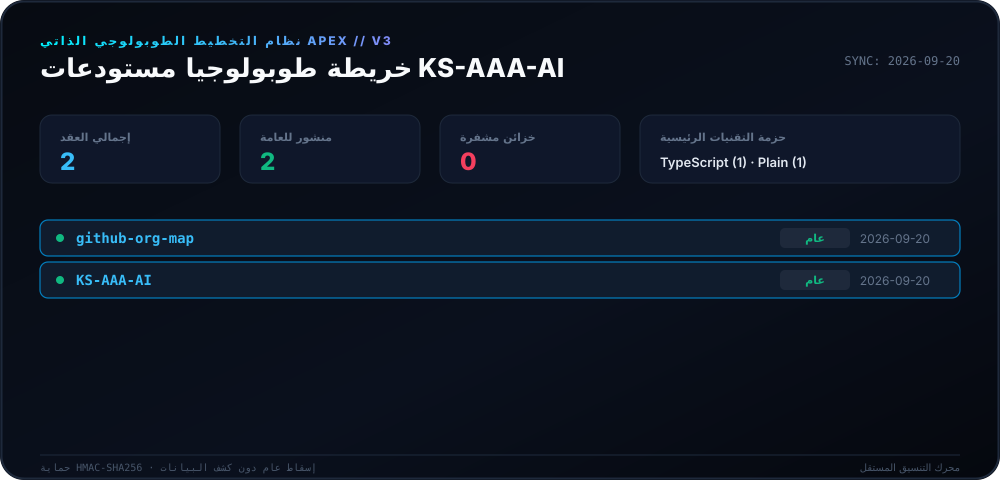
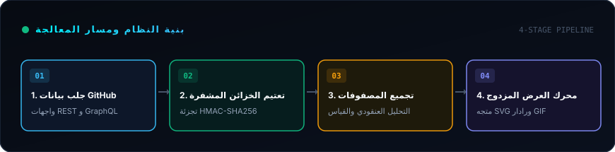
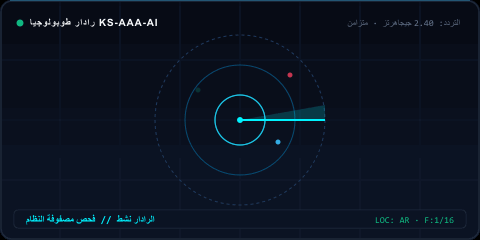

<div dir="rtl">

<div align="center">

# 🛰️ محرك تخطيط Apex (v3.0)

<p>
  <strong>نظام تخطيط طوبولوجي ذاتي يومي لمنظومة KS-AAA-AI على GitHub.</strong>
</p>

<p align="center">
  <a href="../README.md">🇺🇸 English</a> · 
  <a href="ko.md">🇰🇷 한국어</a> · 
  <a href="zh-CN.md">🇨🇳 中文</a> · 
  <a href="es.md">🇪🇸 Español</a> · 
  <a href="hi.md">🇮🇳 हिन्दी</a> · 
  <strong>🇸🇦 العربية</strong> · 
  <a href="pt-BR.md">🇧🇷 Português</a> · 
  <a href="ru.md">🇷🇺 Русский</a> · 
  <a href="fr.md">🇫🇷 Français</a> · 
  <a href="id.md">🇮🇩 Bahasa Indonesia</a>
</p>

<p align="center">
  
  
  
  
</p>

<p align="center">
  <picture>
    <source srcset="../assets/locales/ar/org-map.svg" type="image/svg+xml" />
    
  </picture>
</p>

</div>

---

<details>
<summary><h3 style="display:inline-block; margin:0; cursor:pointer;">🏛️ نظرة عامة على النظام والهندسة المعمارية</h3></summary>
<br />

**محرك التخطيط Apex** هو نظام متطور وعالي الإنتاجية للقياس عن بُعد ورسم الطوبولوجيا الذاتية لمنظومة **KS-AAA-AI** على GitHub، ويقوم بتحويل بيانات المستودعات إلى شاشة معلومات مصفوفية مع حماية الخصوصية بانعدام المعرفة.

<p align="center">
  <picture>
    <source srcset="../assets/locales/ar/architecture.svg" type="image/svg+xml" />
    
  </picture>
</p>

1. **خزائن الخصوصية بانعدام المعرفة**: تخضع المستودعات الخاصة لتحويل HMAC-SHA256 (`APEX-VAULT-XXXXXXXX`) لضمان عدم تسريب الأسماء الداخلية والبيانات إطلاقاً.
2. **تخطيط طوبولوجي حتمي**: تبقى المعرّفات متسقة ومستقرة عبر أوقات التشغيل المختلفة باستخدام مفتاح التشفير نفسه.
3. **مسار عرض مزدوج**: توليد متزامن لرسوم المتجهات عالية الدقة SVG وصور الرادار المتحركة GIF.
4. **أتمتة المعالجة الذاتية**: سير عمل GitHub Actions مجدول يومياً (`00:00 بتوقيت كوريا`) مع ميزة التراجع التدريجي لتجنب قيود واجهة برمجة التطبيقات.

</details>

---

<details>
<summary><h3 style="display:inline-block; margin:0; cursor:pointer;">📡 القياس الحي والمسح الراداري</h3></summary>
<br />

تمثيل بصري متجدد وديناميكي لحركة الرادار والقياس عن بُعد يتم إنشاؤه بدقة بواسطة المحرك.

<p align="center">
  <picture>
    <source srcset="../assets/locales/ar/org-map.gif" type="image/gif" />
    
  </picture>
</p>

</details>

---

<details>
<summary><h3 style="display:inline-block; margin:0; cursor:pointer;">🛠️ البدء والتشغيل المحلي</h3></summary>
<br />

### المتطلبات الأساسية
- Node.js >= 20
- npm / pnpm / yarn

### البدء السريع
```bash
# Clone the repository
git clone https://github.com/KS-AAA-AI/github-org-map.git
cd github-org-map

# Install dependencies
npm install

# Run autonomous pipeline
export GITHUB_TOKEN="your_personal_token"
export MASK_SALT="your_cryptographic_salt"
npm run generate
```

</details>

---

<details>
<summary><h3 style="display:inline-block; margin:0; cursor:pointer;">🔒 معايير الأمان وضمان الخصوصية</h3></summary>
<br />

- **صفر تسريب للرموز**: تتم معالجة الرموز في الذاكرة المؤقتة فقط ولا تُكتب أبداً على القرص.
- **تصميم الإغلاق الآمن**: في حال فقدان مفتاح التشفير `MASK_SALT` يتوقف النظام فوراً لحماية البيانات.
- **عزل الموارد المحلية**: تخدم كافة الشارات والرسومات مباشرة من شجرة المستودع دون الاعتماد على شبكات CDN الخارجية.

</details>

---

<div align="center">
<sub>مرخص بموجب [ترخيص MIT](../LICENSE). كافة الحقوق محفوظة © 2026 KS-AAA-AI.</sub>
</div>

</div>
