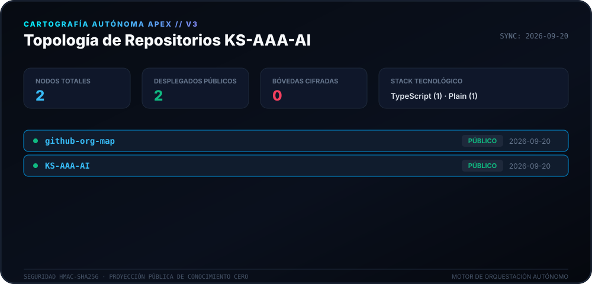
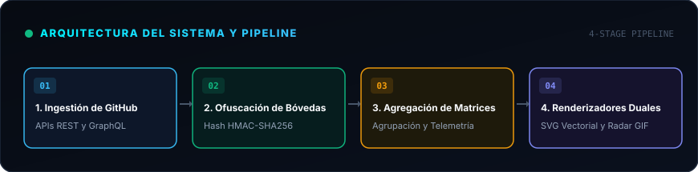
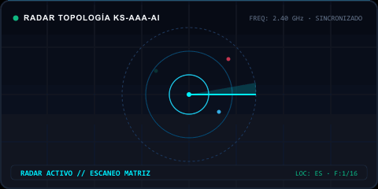

<div align="center">

# 🛰️ Motor de Cartografía Apex (v3.0)

<p>
  <strong>Cartografía autónoma diaria y mapeo de topología para el ecosistema KS-AAA-AI.</strong>
</p>

<p align="center">
  <a href="../README.md">🇺🇸 English</a> · 
  <a href="ko.md">🇰🇷 한국어</a> · 
  <a href="zh-CN.md">🇨🇳 中文</a> · 
  <strong>🇪🇸 Español</strong> · 
  <a href="hi.md">🇮🇳 हिन्दी</a> · 
  <a href="ar.md">🇸🇦 العربية</a> · 
  <a href="pt-BR.md">🇧🇷 Português</a> · 
  <a href="ru.md">🇷🇺 Русский</a> · 
  <a href="fr.md">🇫🇷 Français</a> · 
  <a href="id.md">🇮🇩 Bahasa Indonesia</a>
</p>

<p align="center">
  
  
  
  
</p>

<p align="center">
  <picture>
    <source srcset="../assets/locales/es/org-map.svg" type="image/svg+xml" />
    
  </picture>
</p>

</div>

---

<details>
<summary><h3 style="display:inline-block; margin:0; cursor:pointer;">🏛️ Descripción General y Arquitectura</h3></summary>
<br />

**Apex Cartography Engine** es un sistema moderno de telemetría autónoma y visualización de topología diseñado para el ecosistema GitHub de **KS-AAA-AI**. Transforma repositorios dispersos en un HUD cibernético con garantías criptográficas de conocimiento cero.

<p align="center">
  <picture>
    <source srcset="../assets/locales/es/architecture.svg" type="image/svg+xml" />
    
  </picture>
</p>

1. **Bóveda de Privacidad de Conocimiento Cero**: Los repositorios privados se transforman mediante HMAC-SHA256 (`APEX-VAULT-XXXXXXXX`), garantizando que los identificadores internos nunca se expongan al público.
2. **Mapeo Topológico Determinista**: Los identificadores permanecen estables a través de las ejecuciones bajo la misma sal criptográfica.
3. **Pipelines de Renderizado Dual**: Generación simultánea de Canvas Vectorial SVG de alta resolución y GIF animado de radar.
4. **Automatización con Autorrecuperación**: Flujo de trabajo programado diario en GitHub Actions (`00:00 KST`) con retroceso exponencial contra límites de API.

</details>

---

<details>
<summary><h3 style="display:inline-block; margin:0; cursor:pointer;">📡 Telemetría en Vivo y Escaneo de Radar</h3></summary>
<br />

Visualización dinámica de radar y telemetría generada de forma determinista por el motor de cartografía.

<p align="center">
  <picture>
    <source srcset="../assets/locales/es/org-map.gif" type="image/gif" />
    
  </picture>
</p>

</details>

---

<details>
<summary><h3 style="display:inline-block; margin:0; cursor:pointer;">🛠️ Comenzando y Ejecución Local</h3></summary>
<br />

### Requisitos Previos
- Node.js >= 20
- npm / pnpm / yarn

### Inicio Rápido
```bash
# Clone the repository
git clone https://github.com/KS-AAA-AI/github-org-map.git
cd github-org-map

# Install dependencies
npm install

# Run autonomous pipeline
export GITHUB_TOKEN="your_personal_token"
export MASK_SALT="your_cryptographic_salt"
npm run generate
```

</details>

---

<details>
<summary><h3 style="display:inline-block; margin:0; cursor:pointer;">🔒 Barreras de Seguridad y Privacidad</h3></summary>
<br />

- **Cero Fuga de Tokens**: Los tokens se evalúan en memoria efímera y nunca se escriben en disco ni artefactos.
- **Diseño a Prueba de Fallos**: Si `MASK_SALT` falta o se altera, el pipeline finaliza de forma segura.
- **Aislamiento de Recursos Locales**: Todos los gráficos se sirven directamente desde el árbol del repositorio sin CDNs externas.

</details>

---

<div align="center">
<sub>Publicado bajo la [Licencia MIT](../LICENSE). Copyright © 2026 KS-AAA-AI.</sub>
</div>
