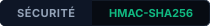
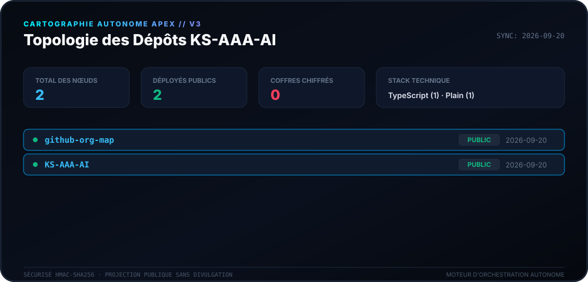
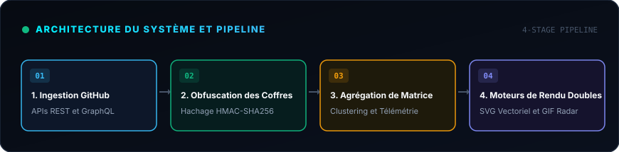
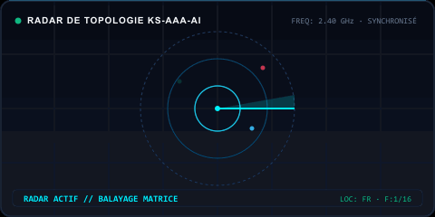

<div align="center">

# 🛰️ Moteur de Cartographie Apex (v3.0)

<p>
  <strong>Cartographie autonome quotidienne et cartographie de topologie pour l’écosystème KS-AAA-AI.</strong>
</p>

<p align="center">
  <a href="../README.md">🇺🇸 English</a> · 
  <a href="ko.md">🇰🇷 한국어</a> · 
  <a href="zh-CN.md">🇨🇳 中文</a> · 
  <a href="es.md">🇪🇸 Español</a> · 
  <a href="hi.md">🇮🇳 हिन्दी</a> · 
  <a href="ar.md">🇸🇦 العربية</a> · 
  <a href="pt-BR.md">🇧🇷 Português</a> · 
  <a href="ru.md">🇷🇺 Русский</a> · 
  <strong>🇫🇷 Français</strong> · 
  <a href="id.md">🇮🇩 Bahasa Indonesia</a>
</p>

<p align="center">
  
  
  
  
</p>

<p align="center">
  <picture>
    <source srcset="../assets/locales/fr/org-map.svg" type="image/svg+xml" />
    
  </picture>
</p>

</div>

---

<details>
<summary><h3 style="display:inline-block; margin:0; cursor:pointer;">🏛️ Vue d’Ensemble du Système et Architecture</h3></summary>
<br />

**Apex Cartography Engine** est un système moderne de télémétrie autonome et de visualisation topologique conçu pour l’écosystème GitHub de **KS-AAA-AI**. Il transforme les dépôts en un HUD cybernétique protégé par des preuves à divulgation nulle de connaissance.

<p align="center">
  <picture>
    <source srcset="../assets/locales/fr/architecture.svg" type="image/svg+xml" />
    
  </picture>
</p>

1. **Coffres Privés à Preuve Nulle**: Les dépôts privés subissent une transformation HMAC-SHA256 (`APEX-VAULT-XXXXXXXX`), garantissant l’absence totale de fuite.
2. **Cartographie Topologique Déterministe**: Les identifiants restent constants à chaque exécution sous le même sel cryptographique.
3. **Double Pipeline de Rendu**: Génération simultanée de SVG vectoriel ultra-précis et de GIF radar animé.
4. **Automatisation Auto-Cicatrisante**: Workflow GitHub Actions quotidien (`00:00 KST`) avec repli exponentiel contre les limitations d'API.

</details>

---

<details>
<summary><h3 style="display:inline-block; margin:0; cursor:pointer;">📡 Télémétrie en Direct et Balayage Radar</h3></summary>
<br />

Représentation visuelle animée du balayage radar générée de façon déterministe.

<p align="center">
  <picture>
    <source srcset="../assets/locales/fr/org-map.gif" type="image/gif" />
    
  </picture>
</p>

</details>

---

<details>
<summary><h3 style="display:inline-block; margin:0; cursor:pointer;">🛠️ Prise en Main et Exécution Locale</h3></summary>
<br />

### Prérequis
- Node.js >= 20
- npm / pnpm / yarn

### Démarrage Rapide
```bash
# Clone the repository
git clone https://github.com/KS-AAA-AI/github-org-map.git
cd github-org-map

# Install dependencies
npm install

# Run autonomous pipeline
export GITHUB_TOKEN="your_personal_token"
export MASK_SALT="your_cryptographic_salt"
npm run generate
```

</details>

---

<details>
<summary><h3 style="display:inline-block; margin:0; cursor:pointer;">🔒 Garde-fous de Sécurité et Confidentialité</h3></summary>
<br />

- **Zéro Fuite de Jeton**: Les jetons sont analysés uniquement en mémoire éphémère et jamais écrits sur disque.
- **Conception Fail-Closed**: En l'absence de `MASK_SALT`, le pipeline s'interrompt immédiatement par sécurité.
- **Isolation des Ressources Locales**: Tous les badges et graphiques sont servis directement sans CDN tiers.

</details>

---

<div align="center">
<sub>Publié sous la [Licence MIT](../LICENSE). Copyright © 2026 KS-AAA-AI.</sub>
</div>
