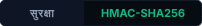
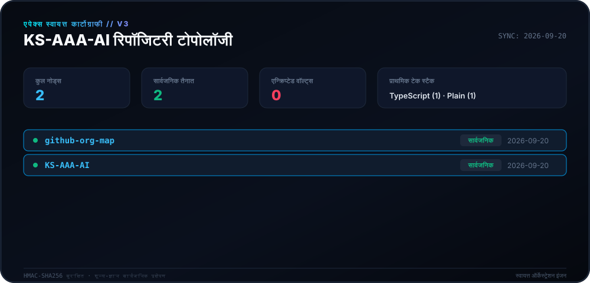
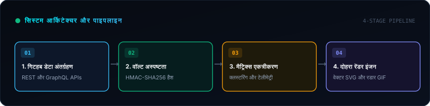
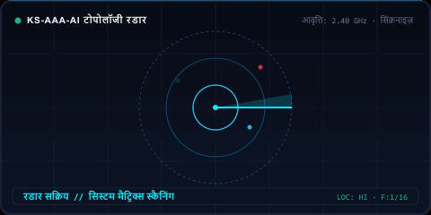

<div align="center">

# 🛰️ एपेक्स कार्टोग्राफी इंजन (v3.0)

<p>
  <strong>KS-AAA-AI पारिस्थितिकी तंत्र के लिए स्वायत्त दैनिक कार्टोग्राफी और टोपोलॉजी मैपिंग।</strong>
</p>

<p align="center">
  <a href="../README.md">🇺🇸 English</a> · 
  <a href="ko.md">🇰🇷 한국어</a> · 
  <a href="zh-CN.md">🇨🇳 中文</a> · 
  <a href="es.md">🇪🇸 Español</a> · 
  <strong>🇮🇳 हिन्दी</strong> · 
  <a href="ar.md">🇸🇦 العربية</a> · 
  <a href="pt-BR.md">🇧🇷 Português</a> · 
  <a href="ru.md">🇷🇺 Русский</a> · 
  <a href="fr.md">🇫🇷 Français</a> · 
  <a href="id.md">🇮🇩 Bahasa Indonesia</a>
</p>

<p align="center">
  
  
  
  
</p>

<p align="center">
  <picture>
    <source srcset="../assets/locales/hi/org-map.svg" type="image/svg+xml" />
    
  </picture>
</p>

</div>

---

<details>
<summary><h3 style="display:inline-block; margin:0; cursor:pointer;">🏛️ सिस्टम अवलोकन और वास्तुकला</h3></summary>
<br />

**Apex Cartography Engine** **KS-AAA-AI** गिटहब पारिस्थितिकी तंत्र के लिए एक आधुनिक स्वायत्त टेलीमेट्री और टोपोलॉजी विज़ुअलाइज़ेशन सिस्टम है। यह रिपॉजिटरी स्थिति को शून्य-ज्ञान सुरक्षा के साथ साइबरनेटिक मैट्रिक्स HUD में परिवर्तित करता है।

<p align="center">
  <picture>
    <source srcset="../assets/locales/hi/architecture.svg" type="image/svg+xml" />
    
  </picture>
</p>

1. **शून्य-ज्ञान गोपनीयता वॉल्टिंग**: निजी रिपॉजिटरी HMAC-SHA256 परिवर्तन (`APEX-VAULT-XXXXXXXX`) से गुजरते हैं, जिससे आंतरिक विवरण कभी भी सार्वजनिक रूप से सामने नहीं आते हैं।
2. **नियतात्मक टोपोलॉजी मैपिंग**: पहचानकर्ता समान क्रिप्टोग्राफ़िक साल्ट के तहत स्थिर रहते हैं।
3. **दोहरी रेंडर पाइपलाइन**: उच्च घनत्व वेक्टर कैनवास SVG और रडार GIF का एक साथ निर्माण।
4. **स्व-उपचार स्वचालन**: API दर-सीमा बैकऑफ़ के साथ दैनिक निर्धारित GitHub Actions वर्कफ़्लो (`00:00 KST`)।

</details>

---

<details>
<summary><h3 style="display:inline-block; margin:0; cursor:pointer;">📡 लाइव टेलीमेट्री और रडार स्कैन</h3></summary>
<br />

कार्टोग्राफी इंजन द्वारा नियतात्मक रूप से उत्पन्न रडार दृश्य प्रस्तुति।

<p align="center">
  <picture>
    <source srcset="../assets/locales/hi/org-map.gif" type="image/gif" />
    
  </picture>
</p>

</details>

---

<details>
<summary><h3 style="display:inline-block; margin:0; cursor:pointer;">🛠️ शुरुआत और स्थानीय निष्पादन</h3></summary>
<br />

### पूर्वापेक्षाएँ
- Node.js >= 20
- npm / pnpm / yarn

### त्वरित शुरुआत
```bash
# Clone the repository
git clone https://github.com/KS-AAA-AI/github-org-map.git
cd github-org-map

# Install dependencies
npm install

# Run autonomous pipeline
export GITHUB_TOKEN="your_personal_token"
export MASK_SALT="your_cryptographic_salt"
npm run generate
```

</details>

---

<details>
<summary><h3 style="display:inline-block; margin:0; cursor:pointer;">🔒 सुरक्षा गार्डरेल्स और गोपनीयता गारंटी</h3></summary>
<br />

- **शून्य टोकन रिसाव**: टोकन का मूल्यांकन केवल मेमोरी में किया जाता है और डिस्क पर कभी नहीं लिखा जाता है।
- **फेल-क्लोज्ड डिज़ाइन**: यदि `MASK_SALT` गायब है, तो पाइपलाइन सुरक्षित रूप से समाप्त हो जाती है।
- **स्थानीय संपत्ति अलगाव**: सभी ग्राफिक्स बिना किसी बाहरी CDN के सीधे रिपॉजिटरी से परोसे जाते हैं।

</details>

---

<div align="center">
<sub>[MIT लाइसेंस](../LICENSE) के तहत जारी। सर्वाधिकार सुरक्षित © 2026 KS-AAA-AI।</sub>
</div>
