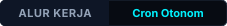
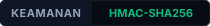
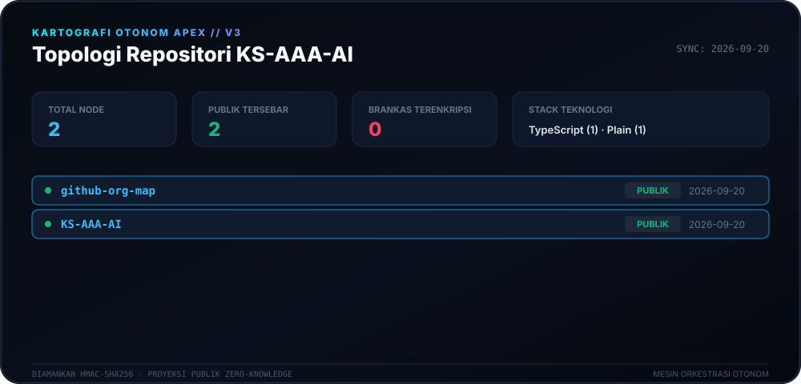
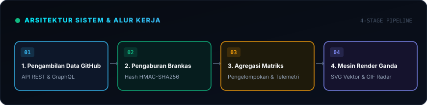
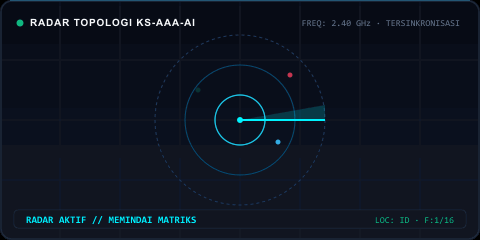

<div align="center">

# 🛰️ Mesin Kartografi Apex (v3.0)

<p>
  <strong>Kartografi otonom harian dan pemetaan topologi untuk ekosistem KS-AAA-AI.</strong>
</p>

<p align="center">
  <a href="../README.md">🇺🇸 English</a> · 
  <a href="ko.md">🇰🇷 한국어</a> · 
  <a href="zh-CN.md">🇨🇳 中文</a> · 
  <a href="es.md">🇪🇸 Español</a> · 
  <a href="hi.md">🇮🇳 हिन्दी</a> · 
  <a href="ar.md">🇸🇦 العربية</a> · 
  <a href="pt-BR.md">🇧🇷 Português</a> · 
  <a href="ru.md">🇷🇺 Русский</a> · 
  <a href="fr.md">🇫🇷 Français</a> · 
  <strong>🇮🇩 Bahasa Indonesia</strong>
</p>

<p align="center">
  
  
  
  
</p>

<p align="center">
  <picture>
    <source srcset="../assets/locales/id/org-map.svg" type="image/svg+xml" />
    
  </picture>
</p>

</div>

---

<details>
<summary><h3 style="display:inline-block; margin:0; cursor:pointer;">🏛️ Ringkasan Sistem & Arsitektur</h3></summary>
<br />

**Apex Cartography Engine** adalah sistem telemetri otonom dan visualisasi topologi modern yang disesuaikan untuk ekosistem GitHub **KS-AAA-AI**. Mengubah repositori menjadi HUD matriks sibernetik dengan perlindungan kriptografi zero-knowledge.

<p align="center">
  <picture>
    <source srcset="../assets/locales/id/architecture.svg" type="image/svg+xml" />
    
  </picture>
</p>

1. **Brankas Privasi Zero-Knowledge**: Repositori privat melalui transformasi HMAC-SHA256 (`APEX-VAULT-XXXXXXXX`), memastikan informasi rahasia tidak pernah terekspos ke publik.
2. **Pemetaan Topologi Deterministik**: Pengidentifikasi tetap konsisten di setiap generasi di bawah garam kriptografi yang sama.
3. **Alur Render Ganda**: Menghasilkan Kanvas Vektor SVG berdensitas tinggi dan GIF animasi radar pemindai secara bersamaan.
4. **Otomasi Pemulihan Mandiri**: Alur kerja GitHub Actions harian yang dijadwalkan (`00:00 KST`) dengan backoff eksponensial terhadap batas API.

</details>

---

<details>
<summary><h3 style="display:inline-block; margin:0; cursor:pointer;">📡 Telemetri Langsung & Pemindaian Radar</h3></summary>
<br />

Representasi visual radar dan telemetri dinamis yang dihasilkan secara deterministik.

<p align="center">
  <picture>
    <source srcset="../assets/locales/id/org-map.gif" type="image/gif" />
    
  </picture>
</p>

</details>

---

<details>
<summary><h3 style="display:inline-block; margin:0; cursor:pointer;">🛠️ Memulai & Eksekusi Lokal</h3></summary>
<br />

### Prasyarat
- Node.js >= 20
- npm / pnpm / yarn

### Panduan Cepat
```bash
# Clone the repository
git clone https://github.com/KS-AAA-AI/github-org-map.git
cd github-org-map

# Install dependencies
npm install

# Run autonomous pipeline
export GITHUB_TOKEN="your_personal_token"
export MASK_SALT="your_cryptographic_salt"
npm run generate
```

</details>

---

<details>
<summary><h3 style="display:inline-block; margin:0; cursor:pointer;">🔒 Batasan Keamanan & Privasi</h3></summary>
<br />

- **Nol Kebocoran Token**: Token hanya dievaluasi dalam memori sementara dan tidak pernah disimpan ke disk.
- **Desain Fail-Closed**: Jika `MASK_SALT` hilang dalam proses produksi, pipeline akan berhenti demi keamanan.
- **Isolasi Aset Lokal**: Semua lencana dan grafik disajikan langsung dari repositori tanpa CDN pelacak eksternal.

</details>

---

<div align="center">
<sub>Dirilis di bawah [Lisensi MIT](../LICENSE). Hak Cipta © 2026 KS-AAA-AI.</sub>
</div>
