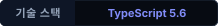
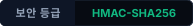
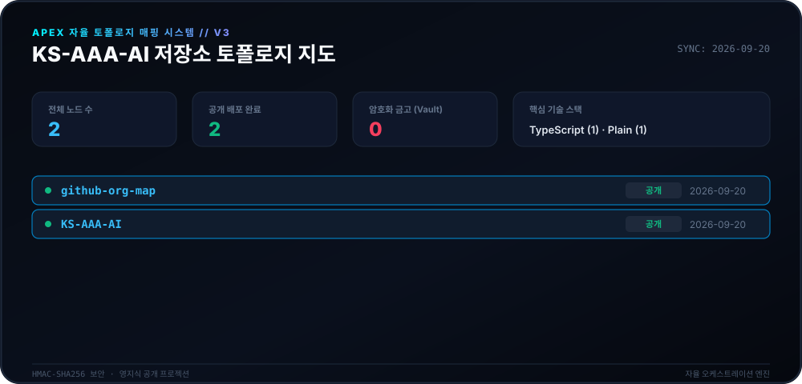
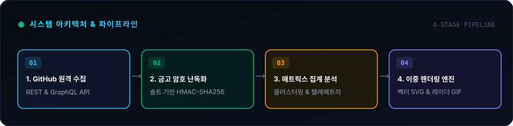
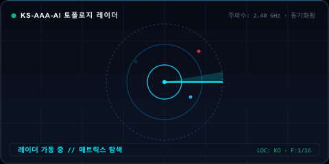

<div align="center">

# 🛰️ Apex 카토그래피 엔진 (v3.0)

<p>
  <strong>KS-AAA-AI 생태계를 위한 자율 일일 카토그래피 및 토폴로지 매핑 시스템.</strong>
</p>

<p align="center">
  <a href="../README.md">🇺🇸 English</a> · 
  <strong>🇰🇷 한국어</strong> · 
  <a href="zh-CN.md">🇨🇳 中文</a> · 
  <a href="es.md">🇪🇸 Español</a> · 
  <a href="hi.md">🇮🇳 हिन्दी</a> · 
  <a href="ar.md">🇸🇦 العربية</a> · 
  <a href="pt-BR.md">🇧🇷 Português</a> · 
  <a href="ru.md">🇷🇺 Русский</a> · 
  <a href="fr.md">🇫🇷 Français</a> · 
  <a href="id.md">🇮🇩 Bahasa Indonesia</a>
</p>

<p align="center">
  
  
  
  
</p>

<p align="center">
  <picture>
    <source srcset="../assets/locales/ko/org-map.svg" type="image/svg+xml" />
    
  </picture>
</p>

</div>

---

<details>
<summary><h3 style="display:inline-block; margin:0; cursor:pointer;">🏛️ 시스템 개요 및 아키텍처</h3></summary>
<br />

**Apex 카토그래피 엔진**은 **KS-AAA-AI** GitHub 생태계를 위해 설계된 최신 고처리량 자율 텔레메트리 및 토폴로지 시각화 시스템입니다. 분산된 저장소 상태를 영지식 암호화 보호 기능이 적용된 사이버네틱 매트릭스 HUD로 변환합니다.

<p align="center">
  <picture>
    <source srcset="../assets/locales/ko/architecture.svg" type="image/svg+xml" />
    
  </picture>
</p>

1. **영지식 프라이버시 금고화 (Vaulting)**: 비공개 저장소는 솔트 기반 HMAC-SHA256 변환(`APEX-VAULT-XXXXXXXX`)을 거쳐 내부 식별자, 설명, 독점 토픽이 외부에 노출되지 않도록 원천 차단합니다.
2. **결정론적 토폴로지 매핑**: 동일한 암호화 솔트 환경에서 저장소 식별자의 불변성을 유지합니다.
3. **이중 렌더링 파이프라인**: 초고해상도 벡터 캔버스 SVG 및 동적 스캐닝 레이더 GIF를 동시 생성합니다.
4. **자가 복구 자동화**: API 속도 제한 방지 지수 백오프가 적용된 일일 정기 GitHub Actions 워크플로(`매일 00:00 KST`)를 수행합니다.

</details>

---

<details>
<summary><h3 style="display:inline-block; margin:0; cursor:pointer;">📡 실시간 텔레메트리 & 레이더 스캔</h3></summary>
<br />

카토그래피 엔진에 의해 결정론적으로 생성되는 실시간 텔레메트리 및 스위핑 레이더 시각화입니다.

<p align="center">
  <picture>
    <source srcset="../assets/locales/ko/org-map.gif" type="image/gif" />
    
  </picture>
</p>

</details>

---

<details>
<summary><h3 style="display:inline-block; margin:0; cursor:pointer;">🛠️ 시작하기 & 로컬 실행</h3></summary>
<br />

### 사전 요구사항
- Node.js >= 20
- npm / pnpm / yarn

### 빠른 시작
```bash
# Clone the repository
git clone https://github.com/KS-AAA-AI/github-org-map.git
cd github-org-map

# Install dependencies
npm install

# Run autonomous pipeline
export GITHUB_TOKEN="your_personal_token"
export MASK_SALT="your_cryptographic_salt"
npm run generate
```

</details>

---

<details>
<summary><h3 style="display:inline-block; margin:0; cursor:pointer;">🔒 보안 가드레일 & 프라이버시 보증</h3></summary>
<br />

- **토큰 유출 제로**: 액세스 토큰은 휘발성 메모리 내에서만 평가되며 디스크나 산출물에 절대 기록되지 않습니다.
- **안전 실패(Fail-Closed) 설계**: 프로덕션 환경에서 `MASK_SALT`가 누락되거나 변조될 경우 파이프라인이 즉시 안전 중단되어 마스킹되지 않은 레이블 노출을 방지합니다.
- **로컬 에셋 격리**: 모든 시각 뱃지 및 그래픽은 제3자 추적 CDN 없이 저장소 트리 내에서 직접 제공됩니다.

</details>

---

<div align="center">
<sub>[MIT 라이선스](../LICENSE)에 따라 배포됩니다. Copyright © 2026 KS-AAA-AI.</sub>
</div>
