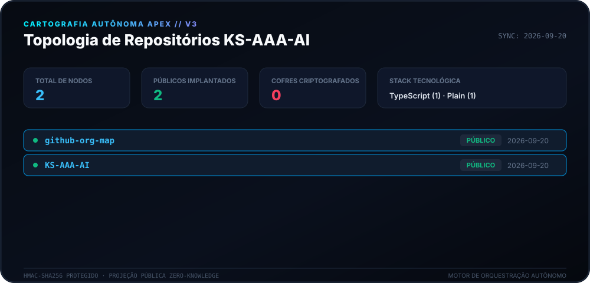
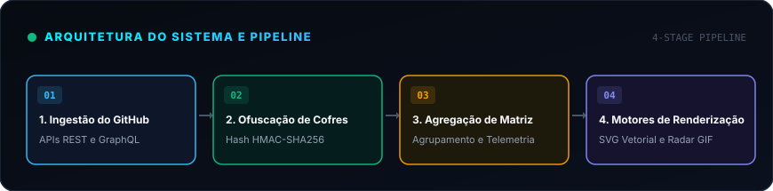
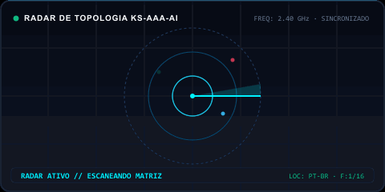

<div align="center">

# 🛰️ Motor de Cartografia Apex (v3.0)

<p>
  <strong>Cartografia autônoma diária e mapeamento de topologia para o ecossistema KS-AAA-AI.</strong>
</p>

<p align="center">
  <a href="../README.md">🇺🇸 English</a> · 
  <a href="ko.md">🇰🇷 한국어</a> · 
  <a href="zh-CN.md">🇨🇳 中文</a> · 
  <a href="es.md">🇪🇸 Español</a> · 
  <a href="hi.md">🇮🇳 हिन्दी</a> · 
  <a href="ar.md">🇸🇦 العربية</a> · 
  <strong>🇧🇷 Português</strong> · 
  <a href="ru.md">🇷🇺 Русский</a> · 
  <a href="fr.md">🇫🇷 Français</a> · 
  <a href="id.md">🇮🇩 Bahasa Indonesia</a>
</p>

<p align="center">
  
  
  
  
</p>

<p align="center">
  <picture>
    <source srcset="../assets/locales/pt-BR/org-map.svg" type="image/svg+xml" />
    
  </picture>
</p>

</div>

---

<details>
<summary><h3 style="display:inline-block; margin:0; cursor:pointer;">🏛️ Visão Geral do Sistema e Arquitetura</h3></summary>
<br />

**Apex Cartography Engine** é um sistema moderno de telemetria autônoma e visualização de topologia desenvolvido para o ecossistema GitHub de **KS-AAA-AI**. Ele transforma repositórios em um HUD cibernético com garantias criptográficas de conhecimento zero.

<p align="center">
  <picture>
    <source srcset="../assets/locales/pt-BR/architecture.svg" type="image/svg+xml" />
    
  </picture>
</p>

1. **Cofres de Privacidade Zero-Knowledge**: Repositórios privados passam por transformação HMAC-SHA256 (`APEX-VAULT-XXXXXXXX`), garantindo que identificadores internos nunca sejam expostos publicamente.
2. **Mapeamento Topológico Determinístico**: Identificadores permanecem estáveis ao longo do tempo sob a mesma chave criptográfica.
3. **Pipelines de Renderização Dupla**: Canvas Vetorial SVG de alta resolução e GIF animado de radar de varredura gerados simultaneamente.
4. **Automação com Autorrecuperação**: Fluxo agendado diário no GitHub Actions (`00:00 KST`) com backoff exponencial contra limites de API.

</details>

---

<details>
<summary><h3 style="display:inline-block; margin:0; cursor:pointer;">📡 Telemetria em Tempo Real e Varredura de Radar</h3></summary>
<br />

Visualização dinâmica de radar gerada deterministicamente pelo motor de cartografia.

<p align="center">
  <picture>
    <source srcset="../assets/locales/pt-BR/org-map.gif" type="image/gif" />
    
  </picture>
</p>

</details>

---

<details>
<summary><h3 style="display:inline-block; margin:0; cursor:pointer;">🛠️ Começando e Execução Local</h3></summary>
<br />

### Pré-requisitos
- Node.js >= 20
- npm / pnpm / yarn

### Início Rápido
```bash
# Clone the repository
git clone https://github.com/KS-AAA-AI/github-org-map.git
cd github-org-map

# Install dependencies
npm install

# Run autonomous pipeline
export GITHUB_TOKEN="your_personal_token"
export MASK_SALT="your_cryptographic_salt"
npm run generate
```

</details>

---

<details>
<summary><h3 style="display:inline-block; margin:0; cursor:pointer;">🔒 Diretrizes de Segurança e Privacidade</h3></summary>
<br />

- **Vazamento Zero de Tokens**: Os tokens são processados em memória volátil e nunca gravados em disco.
- **Design Fail-Closed**: Se o `MASK_SALT` for omitido, o pipeline encerra com segurança para proteger os dados.
- **Isolamento de Ativos Locais**: Todos os emblemas e gráficos são carregados do repositório sem CDNs externas.

</details>

---

<div align="center">
<sub>Lançado sob a [Licença MIT](../LICENSE). Copyright © 2026 KS-AAA-AI.</sub>
</div>
