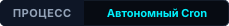
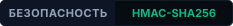
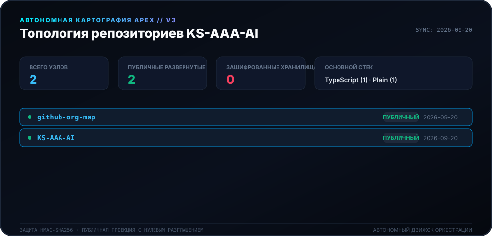
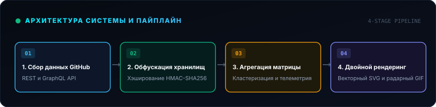
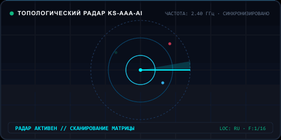

<div align="center">

# 🛰️ Движок картографии Apex (v3.0)

<p>
  <strong>Автономная ежедневная картография и топологическое картирование экосистемы KS-AAA-AI.</strong>
</p>

<p align="center">
  <a href="../README.md">🇺🇸 English</a> · 
  <a href="ko.md">🇰🇷 한국어</a> · 
  <a href="zh-CN.md">🇨🇳 中文</a> · 
  <a href="es.md">🇪🇸 Español</a> · 
  <a href="hi.md">🇮🇳 हिन्दी</a> · 
  <a href="ar.md">🇸🇦 العربية</a> · 
  <a href="pt-BR.md">🇧🇷 Português</a> · 
  <strong>🇷🇺 Русский</strong> · 
  <a href="fr.md">🇫🇷 Français</a> · 
  <a href="id.md">🇮🇩 Bahasa Indonesia</a>
</p>

<p align="center">
  
  
  
  
</p>

<p align="center">
  <picture>
    <source srcset="../assets/locales/ru/org-map.svg" type="image/svg+xml" />
    
  </picture>
</p>

</div>

---

<details>
<summary><h3 style="display:inline-block; margin:0; cursor:pointer;">🏛️ Обзор системы и архитектура</h3></summary>
<br />

**Apex Cartography Engine** — это современная высокопроизводительная система автономной телеметрии и визуализации топологии для экосистемы **KS-AAA-AI** на GitHub. Преобразует состояние репозиториев в кибернетический HUD матрицы с криптографической защитой с нулевым разглашением.

<p align="center">
  <picture>
    <source srcset="../assets/locales/ru/architecture.svg" type="image/svg+xml" />
    
  </picture>
</p>

1. **Хранилища приватности с нулевым разглашением**: Приватные репозитории проходят трансформацию HMAC-SHA256 (`APEX-VAULT-XXXXXXXX`), исключая утечку внутренних данных.
2. **Детерминированное картирование**: Идентификаторы остаются стабильными при использовании одной криптографической соли.
3. **Двойной пайплайн рендеринга**: Одновременная генерация векторного Canvas SVG и анимированного сканирующего GIF радара.
4. **Самовосстанавливающаяся автоматизация**: Ежедневный воркфлоу GitHub Actions (`00:00 KST`) с экспоненциальной задержкой против лимитов API.

</details>

---

<details>
<summary><h3 style="display:inline-block; margin:0; cursor:pointer;">📡 Телеметрия в реальном времени и радар</h3></summary>
<br />

Динамическая визуализация сканирования радара, детерминированно созданная движком картографии.

<p align="center">
  <picture>
    <source srcset="../assets/locales/ru/org-map.gif" type="image/gif" />
    
  </picture>
</p>

</details>

---

<details>
<summary><h3 style="display:inline-block; margin:0; cursor:pointer;">🛠️ Начало работы и локальный запуск</h3></summary>
<br />

### Требования
- Node.js >= 20
- npm / pnpm / yarn

### Быстрый старт
```bash
# Clone the repository
git clone https://github.com/KS-AAA-AI/github-org-map.git
cd github-org-map

# Install dependencies
npm install

# Run autonomous pipeline
export GITHUB_TOKEN="your_personal_token"
export MASK_SALT="your_cryptographic_salt"
npm run generate
```

</details>

---

<details>
<summary><h3 style="display:inline-block; margin:0; cursor:pointer;">🔒 Безопасность и гарантии конфиденциальности</h3></summary>
<br />

- **Нулевая утечка токенов**: Токены обрабатываются исключительно в оперативной памяти и не сохраняются на диск.
- **Отказоустойчивость**: При отсутствии `MASK_SALT` процесс безопасно останавливается для защиты данных.
- **Изоляция локальных ресурсов**: Все графические элементы поставляются напрямую из репозитория без внешних CDN.

</details>

---

<div align="center">
<sub>Выпущено под лицензией [MIT License](../LICENSE). Copyright © 2026 KS-AAA-AI.</sub>
</div>
