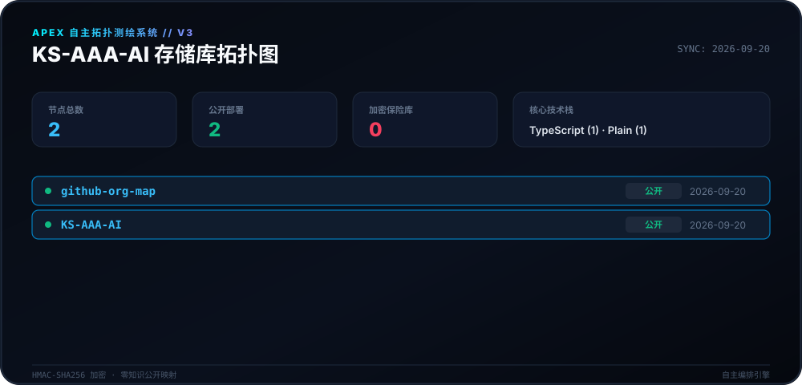
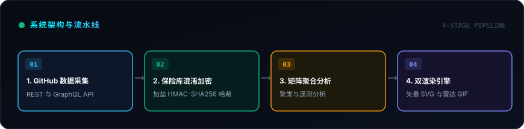
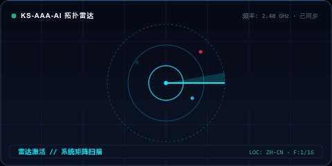

<div align="center">

# 🛰️ Apex 拓扑制图引擎 (v3.0)

<p>
  <strong>面向 KS-AAA-AI 生态系统的自主日常制图与拓扑映射系统。</strong>
</p>

<p align="center">
  <a href="../README.md">🇺🇸 English</a> · 
  <a href="ko.md">🇰🇷 한국어</a> · 
  <strong>🇨🇳 中文</strong> · 
  <a href="es.md">🇪🇸 Español</a> · 
  <a href="hi.md">🇮🇳 हिन्दी</a> · 
  <a href="ar.md">🇸🇦 العربية</a> · 
  <a href="pt-BR.md">🇧🇷 Português</a> · 
  <a href="ru.md">🇷🇺 Русский</a> · 
  <a href="fr.md">🇫🇷 Français</a> · 
  <a href="id.md">🇮🇩 Bahasa Indonesia</a>
</p>

<p align="center">
  
  
  
  
</p>

<p align="center">
  <picture>
    <source srcset="../assets/locales/zh-CN/org-map.svg" type="image/svg+xml" />
    
  </picture>
</p>

</div>

---

<details>
<summary><h3 style="display:inline-block; margin:0; cursor:pointer;">🏛️ 系统概述与架构</h3></summary>
<br />

**Apex 拓扑制图引擎**是专为 **KS-AAA-AI** GitHub 生态系统打造的现代化高通量自主遥测与拓扑可视化系统。它通过零知识密码学保护，将分散的存储库状态转换为赛博矩阵 HUD。

<p align="center">
  <picture>
    <source srcset="../assets/locales/zh-CN/architecture.svg" type="image/svg+xml" />
    
  </picture>
</p>

1. **零知识隐私保险库**: 私有存储库经过加盐 HMAC-SHA256 转换（`APEX-VAULT-XXXXXXXX`），确保内部标识符、描述和专有主题绝不向公开平台泄露。
2. **确定性拓扑映射**: 在相同的密码加盐种子下，存储库标识符在多轮生成中保持稳定。
3. **双渲染流水线**: 同时生成高精度矢量画布 SVG 和动态扫描雷达 GIF。
4. **自愈自动化**: 具备防 API 速率限制指数退避的每日定时 GitHub Actions 工作流（`00:00 KST`）。

</details>

---

<details>
<summary><h3 style="display:inline-block; margin:0; cursor:pointer;">📡 实时遥测与雷达扫描</h3></summary>
<br />

由制图引擎确定性生成的实时遥测与雷达扫描动态视觉呈现。

<p align="center">
  <picture>
    <source srcset="../assets/locales/zh-CN/org-map.gif" type="image/gif" />
    
  </picture>
</p>

</details>

---

<details>
<summary><h3 style="display:inline-block; margin:0; cursor:pointer;">🛠️ 快速上手与本地执行</h3></summary>
<br />

### 环境依赖
- Node.js >= 20
- npm / pnpm / yarn

### 快速开始
```bash
# Clone the repository
git clone https://github.com/KS-AAA-AI/github-org-map.git
cd github-org-map

# Install dependencies
npm install

# Run autonomous pipeline
export GITHUB_TOKEN="your_personal_token"
export MASK_SALT="your_cryptographic_salt"
npm run generate
```

</details>

---

<details>
<summary><h3 style="display:inline-block; margin:0; cursor:pointer;">🔒 安全准则与隐私保障</h3></summary>
<br />

- **零令牌泄露**：访问令牌严格在瞬态内存中计算，绝不写入磁盘或构建产物。
- **故障闭锁设计**：在生产环境中若缺失或破坏 `MASK_SALT`，流水线将安全终止，防止未经脱敏的数据暴露。
- **本地资产隔离**：所有徽章与图形均由存储库内部直接提供，不依赖第三方追踪 CDN。

</details>

---

<div align="center">
<sub>基于 [MIT 许可证](../LICENSE) 发布。版权所有 © 2026 KS-AAA-AI。</sub>
</div>
